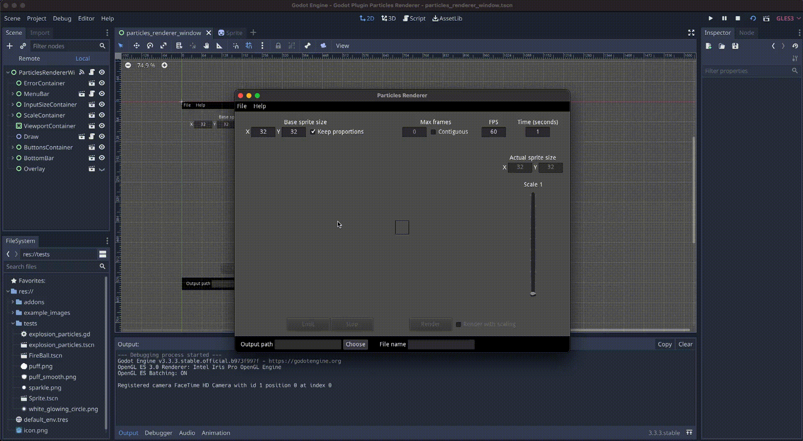

# Godot Plugin Particles Renderer

  

Create sprite sheets from particles ✨.

## 🎦 Demo

## 🛠️ Installation

- Clone the repository or [download](](https://github.com/hiulit/Godot-Plugin-Particles-Renderer/archive/refs/heads/main.zip)) it in a ZIP file.
- Copy the `addons/particles_renderer` folder to the `addons` folders in your project.
- Enable the plugin by going to `Project > Project Settings > Plugins > Particles Renderer > Enable`.

## 🚀 Usage

To open the plugin, go to: `Project > Tools > Particles Renderer`.

Once the plugin window is open, go to: `File > Open` to select a scene.

## ⚙️ Options

### Base sprite size

The size that will used for the particles viewport and as base for scaling.

If `keep proportions` is checked, when changing one value, the other value will be updated with the same value.

### Max frames

The number of frames that will be rendered.

The renderer will remove in-between frames from the total frames to match the number set.

If `contiguous` is checked, the frames will be rendered one after another, without skipping any in-betweens.

If left unset (`0`), all the frames set in [FPS](#fps) will be rendered.

### FPS

The maximum number of frames per second which the particles will be rendered on.

### Time

The seconds the render process will take.

Not relevant if the particles are set to `one_shot`.

### Scale

The scaling factor applied to [Base sprite size](#base-sprite-size).

### Output path

The path where the sprite sheet will be stored.

If no path is set when a file is opened, the path will automatically be the same as the opened file.

### File name

The name of the sprite sheet.

If no name is set when a file is opened, the name will automatically be the same as the opened file.

## 🗒️ Changelog

See [CHANGELOG](/CHANGELOG.md).

## 👤 Author

- hiulit

## 🤝 Contributing

Feel free to:

- [Open an issue](https://github.com/hiulit/Godot-Plugin-Particles-Renderer/issues) if you find a bug.
- [Create a pull request](https://github.com/hiulit/Godot-Plugin-Particles-Renderer/pulls) if you have a new cool feature to add to the project.

## 🙌 Supporting this project

If you find this project helpful, please consider supporting it through any size donations to help make it better.

If you can't, consider sharing it with the world...

... or giving it a [star](https://github.com/hiulit/Godot-Plugin-Particles-Renderer/stargazers).

Thank you very much!

## 📝 Licenses

- Source code: [MIT License](/LICENSE).
